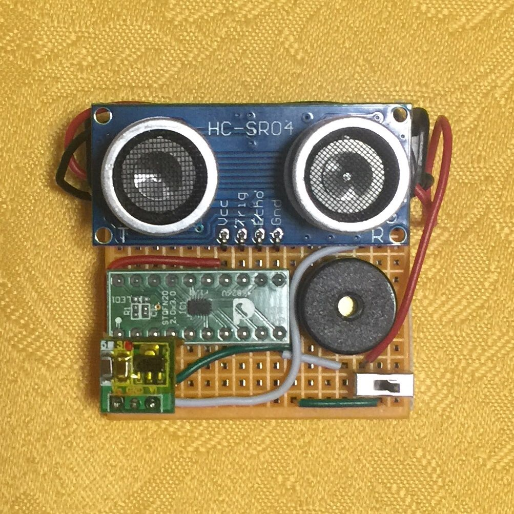
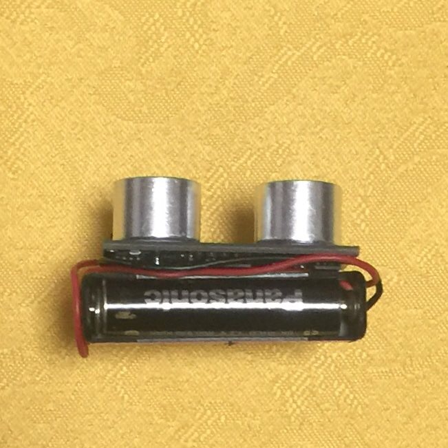
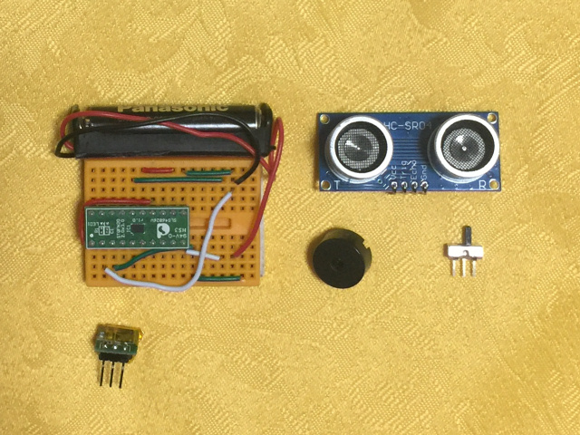
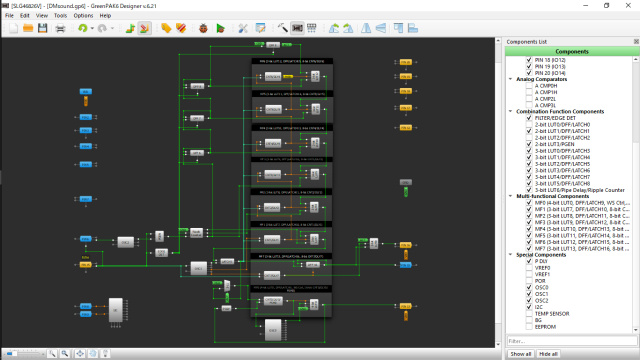

# Social distance alarm badge by GreenPAK.  (緑豆壱拾壱號)

GreenPAKっていうFPGAみたいなデバイスで2m以内に何かが近づくと音で教えてくれるバッジを作ってみました。  
ソーシャルディスタンスを確保できるかもしれません。  
  

物体までの距離が2m以内に近づくと断続的に音が鳴り始め、近づくほど音が高く、間隔が短くなり、物体の接近を知らせます。  
動画⇒Twitterのページ（https://twitter.com/La_zlo/status/1248650387885658113 ）  

## 部品一覧

部品名 | 型番 | 代表的な仕様 | 参考価格(秋月電子)
--- | --- | --- | ---
GreenPAKボード | SLG46826V-DIP | SLG46826V搭載 20-pin DIP 動作電圧: 2.5～5.5V | 秋月取扱なし 241円@Digi-Key
超音波距離センサー | HC-SR04P | 動作電圧: 3～5.5V 3V時検出距離: 2～400cm 検出角度: 15度以内 | 秋月取扱なし 5V品で450円
ステップアップレギュレータ | ？ |入力電圧: 0.9～3.3V 出力電圧: 3.3V ３ピン | 秋月取扱なし 8ピン品で500円
圧電サウンダ | ？ | 14mmφ | 秋月取扱なし 13mmφ品で30円 
スライドスイッチ | ＳＳ１２Ｄ０１Ｇ４等 | １回路２接点 | 25円 
電池ボックス | ？ |単４×１本用 接続用リード線付 | 50円
単４エネループ|BK-4HCD|出力電圧: 1.2V 容量: Min.930mAh | 秋月取扱なし 4個1680円@ヨドバシ
ミニブレッドボード | BB-601等 | 穴数：170 サイズ：45X34.5X8.5mm | 130円
ジャンパーワイヤ | BBJ-140等 | 14種類×10本 | 400円

## 接続図

ブレッドボードにジャンパワイヤーで配線してから、適切な場所に部品をさします。  
はんだ付けは行っていません。  
ステップアップレギュレータの電源端子はGreenPAKボードの端子をNotUseにして共用してます。  
また、ステップアップレギュレータはショート防止のため絶縁テープで包んでいます。  
電池ボックスは両面テープで張り付けました。  

部品を外した時の配線がわかる写真を公開します。  

## 設計データ

  

「GreenPAK Designerソフトウェア」で  
src/SocialDistanceAlarm.gp6  
を開いてご確認ください。  

## Arduinoで焼く方法

自分ではまだ試したことがないのですが、公式の資料を紹介します。  
Arduinoで焼く場合は、こちらのドキュメント及びzipファイルをご参照ください。  
https://www.dialog-semiconductor.com/sites/default/files/an-cm-255_slg468246_mtp_arduino_programming_example.zip  

## GreenPAKについて

GrrenPAKは、Dialog Semiconductor社が販売しているCPLDとFPGAの間を埋めるようなプログラマブルデバイスです。  
汎用ロジックIC数個で組めるような回路の置き換えに適しており、簡単な回路がこれ一個で実現できます。  
ソフトウェアは使わないので、面倒なコーディングは不要です。

回路図入力方式で回路を設計し、内蔵された不揮発メモリに設計を書き込むことで動作します。  
中でも、SLG46826VまたはSLG46826Gは装置に組み込んだまま、I2Cを使って何度でも設計を書き換えることが可能な、とても楽しいデバイスです。  
いろんな回路を書き込んで試せるので、ホビー用途にはこれ一択だと思います。  

設計に必要な「GreenPAK Designerソフトウェア」はこちらから無料で入手することができます。  
https://dialog-semiconductor.com/greenpak-japanese  

公式の遊び方はこちらをご覧ください。  
https://dialog-semiconductor.com/sites/default/files/greenpak_cookbook_1v0_-_japanese.pdf  

ツールの使い方は、アプリのチュートリアルで大体わかりますが、詳細はこちら  
https://dialog-semiconductor.com/sites/default/files/greenpak_designer_user_guide.pdf  

## GreenPAKの開発環境の整え方や設計ノウハウ
私は、K4zuki氏(https://github.com/K4zuki) の下記同人誌で勉強しました。良書です。  

### silego-trial-report  
評価ボード購入からＬチカまで  
https://github.com/K4zuki/silego-trial-report  

### GreenPAKTM 勝手にアプリケーションノート  
NeoPixelでランダムＬチカ/555互換回路  
https://github.com/K4zuki/greenpak-personal-appsnote  

## 免責事項

本記事の正確性については努力しておりますが、当方は利用者が当記事の情報を用いて行う一切の行為について何ら責任を負うものではありません。本記事の情報の利用、内容によって、利用者にいかなる損害、被害が生じても、著者は一切の責任を負いません。ご自身の責任においてご利用いただきますようお願いいたします。  

## Author  

[GitHub/AoiSaya](https://github.com/AoiSaya)  
[Twitter ID @La_zlo](https://twitter.com/La_zlo)  
